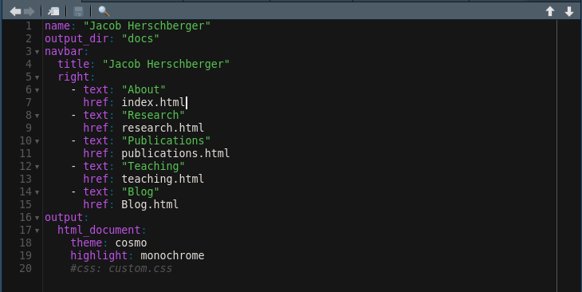
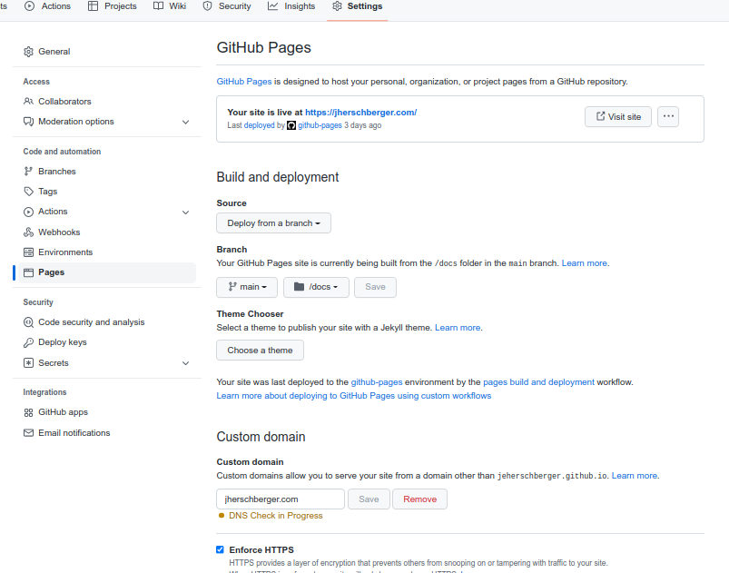
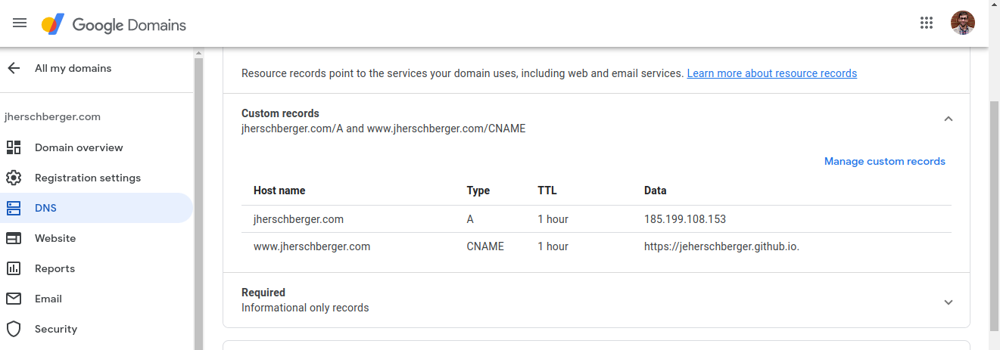

Building a website is pretty easy with Rmarkdown, github pages, and a domain purchased from Google. Rmarkdown provides easy formatting compared to a website that is written in html. Github-pages provides free hosting services and a free domain. However, if you want a more professional domain, you will need to purchase one on Google or any other domain registering site.


For my website template, I downloaded the files from Rstudio cloud that were obtained after clicking on this [link](https://rstudio.cloud/project/181978). I also created the final template that can be used to start the website. These files can also be obtained [here](https://github.com/jeherschberger/Website-Template) on one of my github repositories. Basically I just copied the files that were in the "*-website" folder on Rstudio cloud and modified the "_site.yml" file. I changed the website output folder to be in the "docs" folder. This is where github-pages will look for the html files. Additionally I modified the last lines of the "_site.yml" file to include a none default theme and highlight. You will only need to modify the "_site.yml" file to change the navigation menu and the ".Rmd" files to change each webpage. 

```{r, echo=FALSE, out.width = "700px", fig.align='center', dpi=100}

```

Any ".Rmd" file that is in the main root folder of the repository will output an html file and you need to reference that in the "_site.yml" file.
More website building instructions can be found [here](https://rmarkdown.rstudio.com/lesson-13.html) and Rmarkdown basics can be found [here](https://rmarkdown.rstudio.com/lesson-8.html). Also feel free to checkout my website code [here](https://github.com/jeherschberger/Website)

Once you cloned the website template from my github repository, you can host your website on github-pages. To do that you will need to go in the settings tab of the cloned repository and apply the settings shown below, with your own domain of course :).


```{r, echo=FALSE, out.width = "700px", fig.align='center', dpi=100}

```

Below are the settings I used to register github on the purchased Google domain. Again, you will need to use your own domain name and Github username.

```{r, echo=FALSE, out.width = "700px", fig.align='center', dpi=100}

```


Once you have all this set up, you will need to link your github repository to rstudio. Then you can modify the "_site.yml" and ".Rmd" files to your liking and use Rmarkdown in r studio to build your website. Just make sure you revert the "CNAME" file every time you build your website.