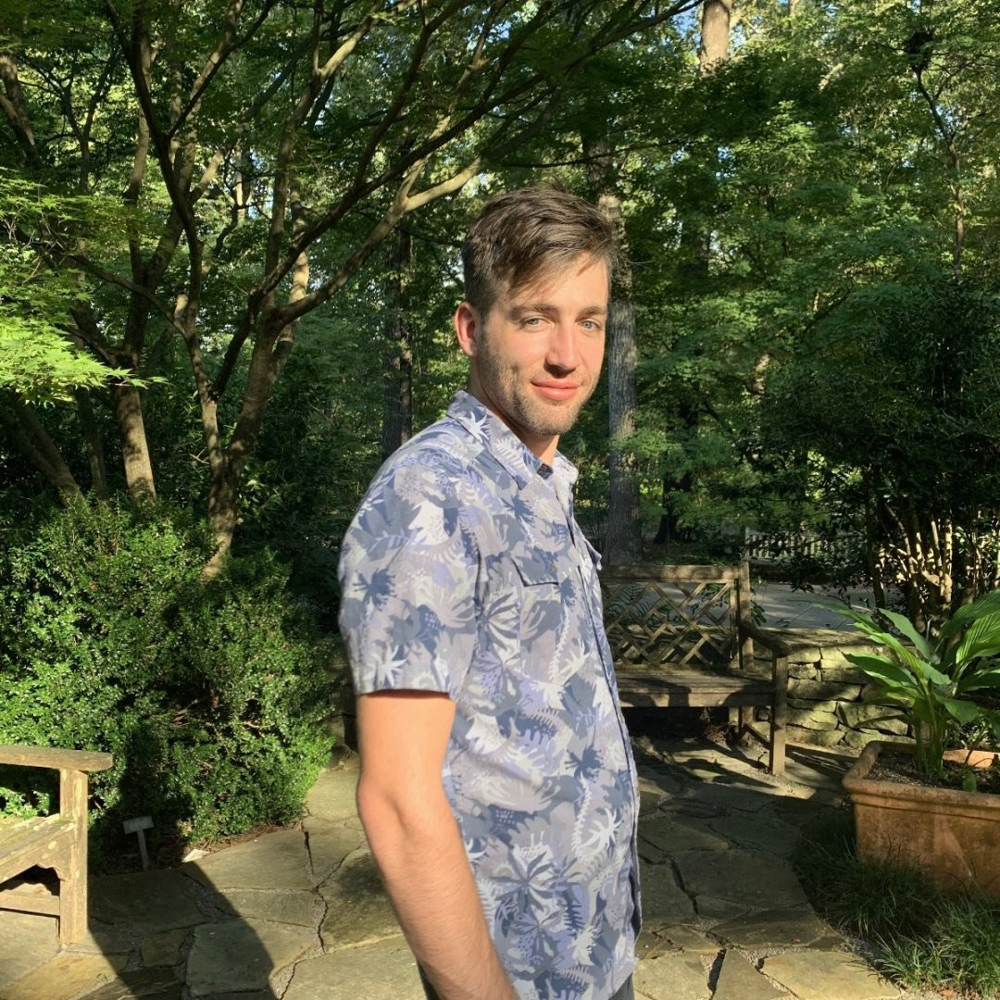

```{r, include=FALSE}
library(knitr)
#from herbvar website
```


```{r, echo=FALSE, out.width = "300px", fig.align='center', dpi=90}

```

I am a current Ph.D Student at the University of Florida. I am investigating how plant chemical defense production correlates with plant tolerence.