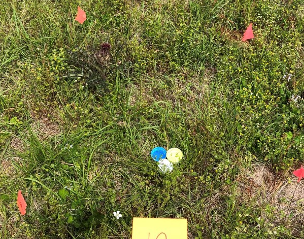
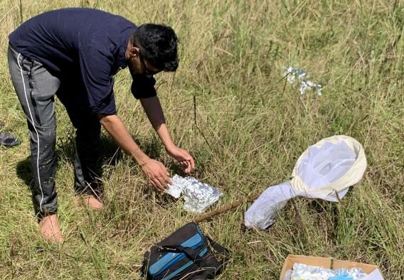
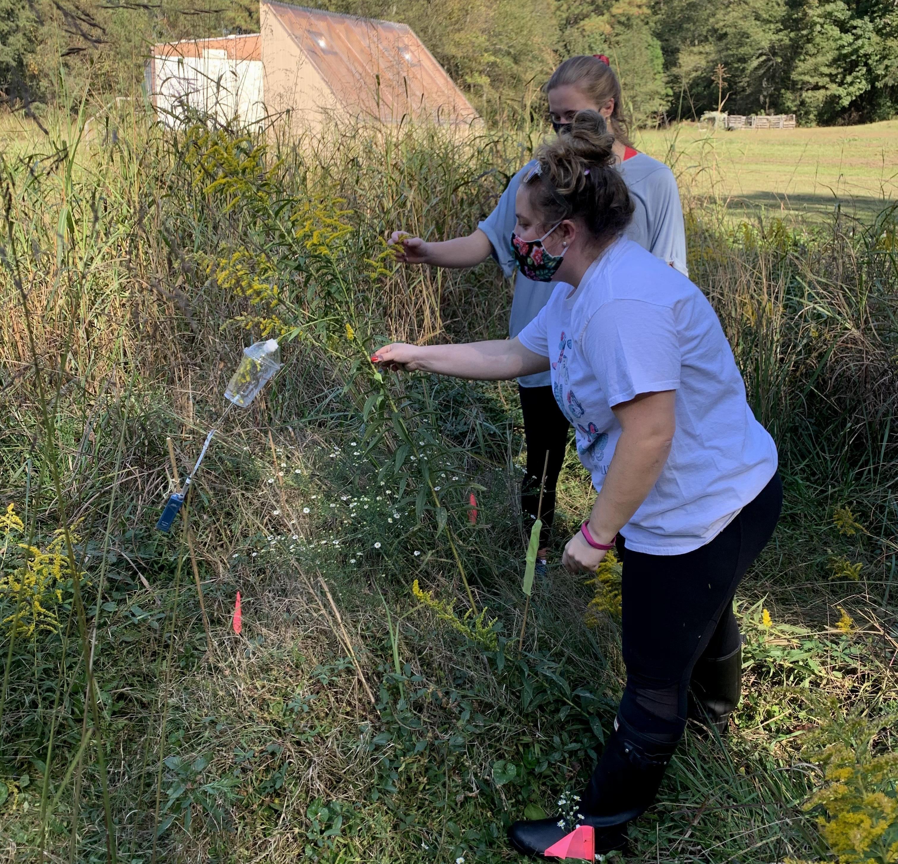
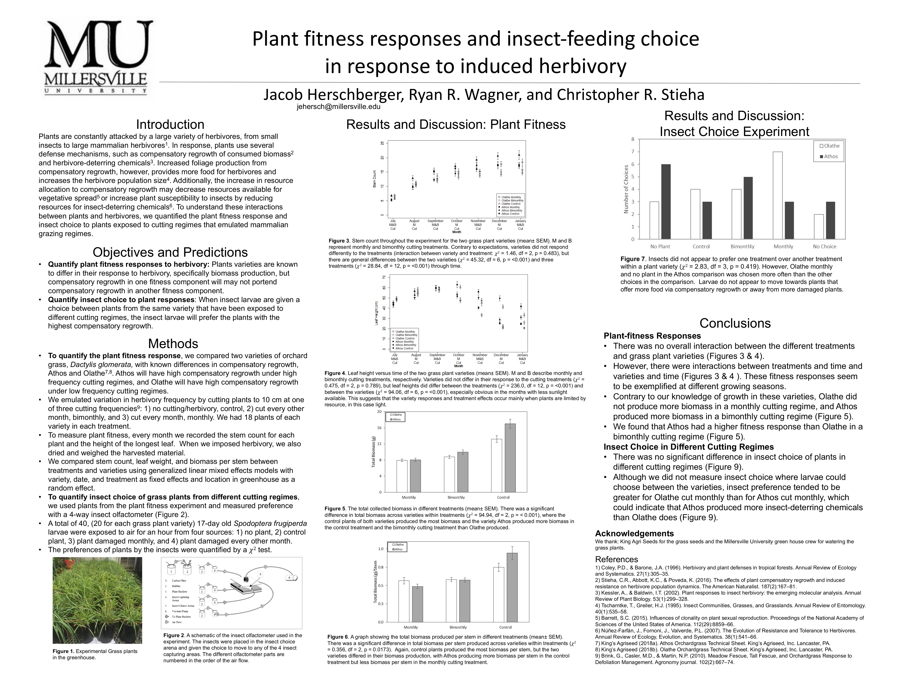

### **Current with [Dr. Phil Hahn](https://plant-herbivore-interactions.net)**

Investigating pollinator community changes in relation to herbivore induced plant chemistry changes and how plant chemical defense production correlates with plant tolerance in relation to insect herbivores. **More info and photos will be posted later**.

### **M.Sc. with [Dr. Monica Kersch-Becker](https://monikersch.wixsite.com/kersch-beckerlab/people)**

These are the multiple projects I worked on while working with Dr. Monica Kersch-Becker.

1. Surveyed pollinators, plants, and floral chemistry to investigate the effects of neighboring plant diversity on pollinator diversity. I would also like to construct plant-floral chemistry-pollinator networks with this survey data.

```{r, echo=FALSE, out.width = "700px", fig.align='center', dpi=100}

```


```{r, echo=FALSE, out.width = "700px", fig.align='center', dpi=100}

```


2. Investigated the combined effects of neighboring intraspecific plants and herbivory on the seed set of *Solidago altissima* via floral volatile organic compounds.

```{r, echo=FALSE, out.width = "700px", fig.align='center', dpi=100}

```


### **Undergraduate with [Dr. Christopher Stieha](https://www.millersville.edu/biology/faculty/c-stieha.php)**

```{r, echo=FALSE, out.width = "1000px", fig.align='center', dpi=100}

```


