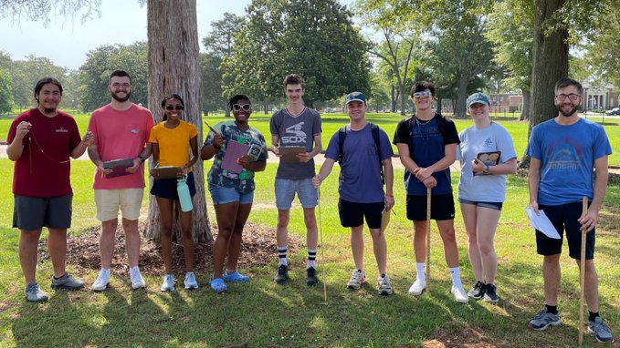

## **Current**

#### University of Florida (Fall 2022 - *present*)

* Entomology

## **Recent**

#### University of Alabama (Spring 2020 - Summer 2022)

* General Biology I & II labs
* Ecology Lab


```{r, echo=FALSE, out.width = "500px", fig.align='center', dpi=100,fig.cap="Summer 2022 Ecology Lab students where I was a teaching assistant for Dr. Kaleb Heinrich"}

```